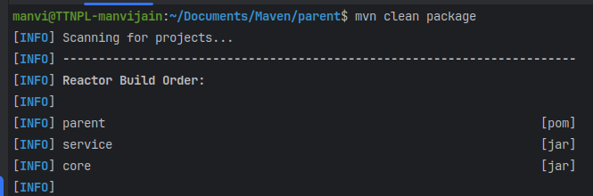
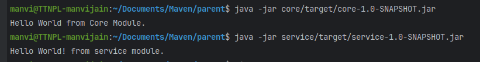

# Multi-Module Maven Project

This project demonstrates a **multi-module Maven structure** consisting of a **parent module** and two child modules:

- **Core Module**
- **Service Module**

## Project Structure
```
parent/
│── pom.xml (Parent POM)
│
├── core/
│   ├── pom.xml
│   ├── src/
│   ├── target/core-1.0-SNAPSHOT.jar
│
├── service/
│   ├── pom.xml
│   ├── src/
│   ├── target/service-1.0-SNAPSHOT.jar
```

## Build & Execution Steps

### 1. Build the project
Run the following command at the root (`parent/`) level:
```sh
mvn clean package
```
This will generate JAR files for both `core` and `service` modules inside their respective `target/` directories.


### 2. Run the JAR files

#### Run Core Module
```sh
java -jar core/target/core-1.0-SNAPSHOT.jar
```
**Output:**
```
Hello World from Core Module.
```

#### Run Service Module
```sh
java -jar service/target/service-1.0-SNAPSHOT.jar
```
**Output:**
```
Hello World! from service module.
```


